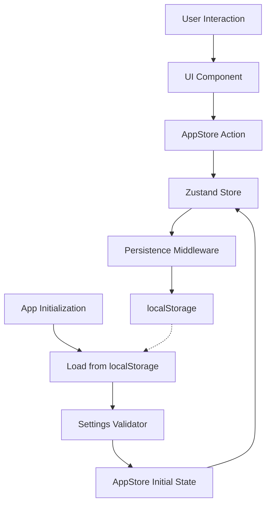

# Design Document: Settings Persistence

## Overview

This design implements persistent storage for user settings in the guitar fretboard viewer application. The solution integrates with the existing Zustand store to automatically save and restore user preferences (selected musical key and display mode) using the browser's localStorage API.

The design follows a middleware pattern, where persistence logic is integrated into the Zustand store creation process. This ensures that settings are automatically saved when changed and loaded when the application starts, providing a seamless user experience.

## Architecture

The persistence system consists of three main components:

1. **Persistence Middleware**: A Zustand middleware that intercepts state changes and saves them to localStorage
2. **Settings Validator**: A utility that validates loaded settings to ensure data integrity
3. **Enhanced AppStore**: The existing store enhanced with persistence capabilities



## Components and Interfaces

### Persistence Middleware

The persistence middleware will be implemented as a Zustand middleware that:
- Intercepts all state changes
- Filters for settings-related changes (selectedKey, displayMode)
- Saves changes to localStorage asynchronously
- Handles localStorage errors gracefully

```typescript
interface PersistenceConfig {
  key: string
  storage: Storage
  partialize?: (state: AppState) => Partial<AppState>
  onRehydrateStorage?: () => void
}

type PersistenceMiddleware<T> = (
  config: StateCreator<T>,
  options: PersistenceConfig
) => StateCreator<T>
```

### Settings Validator

A utility module that validates loaded settings:

```typescript
interface SettingsValidator {
  validateMusicalKey(key: unknown): key is MusicalKey
  validateDisplayMode(mode: unknown): mode is DisplayMode
  validateSettings(settings: unknown): Partial<AppState>
}
```

### Enhanced AppStore Interface

The existing AppStore will be enhanced with persistence:

```typescript
interface PersistedAppState extends AppState {
  // Persistence metadata
  _hasHydrated: boolean
  _persistedAt?: number
}
```

## Data Models

### Persisted Settings Schema

The settings stored in localStorage will follow this schema:

```typescript
interface PersistedSettings {
  selectedKey: MusicalKey
  displayMode: DisplayMode
  version: number // For future migration support
  timestamp: number // When settings were last saved
}
```

### Storage Key Convention

Settings will be stored under the key: `guitar-fretboard-settings`

### Default Values

```typescript
const DEFAULT_SETTINGS: Pick<AppState, 'selectedKey' | 'displayMode'> = {
  selectedKey: 'C',
  displayMode: 'notes'
}
```

## Error Handling

### localStorage Availability Check

```typescript
function isLocalStorageAvailable(): boolean {
  try {
    const test = '__localStorage_test__'
    localStorage.setItem(test, test)
    localStorage.removeItem(test)
    return true
  } catch {
    return false
  }
}
```

### Error Recovery Strategy

1. **localStorage Unavailable**: Fall back to in-memory state only
2. **Corrupted Data**: Clear localStorage and use defaults
3. **Quota Exceeded**: Log error and continue with current state
4. **JSON Parse Error**: Use default values and clear corrupted data

### Error Logging

All persistence errors will be logged using the existing logger utility:

```typescript
import { logger } from '../utils/logger'

// Usage in persistence middleware
logger.warn('Settings persistence failed', { error, fallback: 'using defaults' })
```

## Testing Strategy

### Unit Tests

- Test persistence middleware with mock localStorage
- Test settings validator with various invalid inputs
- Test error handling scenarios (unavailable storage, corrupted data)
- Test default value fallbacks

### Property-Based Tests

Property-based tests will validate the correctness of the persistence system across many different inputs and scenarios.

## Correctness Properties

*A property is a characteristic or behavior that should hold true across all valid executions of a system-essentially, a formal statement about what the system should do. Properties serve as the bridge between human-readable specifications and machine-verifiable correctness guarantees.*

### Property 1: Settings Change Persistence
*For any* valid musical key or display mode change, when the setting is updated in the AppStore, the new value should be immediately saved to localStorage and retrievable.
**Validates: Requirements 1.1, 1.2**

### Property 2: Settings Loading and Restoration
*For any* valid settings stored in localStorage, when the application initializes, the AppStore should be populated with those exact settings.
**Validates: Requirements 1.3**

### Property 3: Settings Validation and Fallback
*For any* combination of valid and invalid settings in localStorage, the persistence manager should accept valid settings and replace invalid ones with corresponding default values.
**Validates: Requirements 2.1, 2.2, 2.3**

### Property 4: Error Logging Without Failure
*For any* localStorage operation that fails, the persistence manager should log the error and continue operation without throwing exceptions or crashing.
**Validates: Requirements 2.4, 4.3**

## Integration Points

### Zustand Store Integration

The persistence will be integrated into the existing Zustand store using Zustand's built-in persist middleware:

```typescript
import { create } from 'zustand'
import { persist, createJSONStorage } from 'zustand/middleware'

// Enhanced store creation
export const useAppStore = create<AppState>()(
  persist(
    (set) => ({
      selectedKey: 'C',
      displayMode: 'notes',
      fretCount: 24,

      setSelectedKey: (key) => set({ selectedKey: key }),
      setDisplayMode: (mode) => set({ displayMode: mode }),
      setFretCount: (count) => set({ fretCount: count }),
    }),
    {
      name: 'guitar-fretboard-settings',
      storage: createJSONStorage(() => localStorage),
      partialize: (state) => ({
        selectedKey: state.selectedKey,
        displayMode: state.displayMode,
      }),
      onRehydrateStorage: () => (state, error) => {
        if (error) {
          logger.warn('Settings rehydration failed', { error })
        } else {
          logger.info('Settings loaded successfully', {
            selectedKey: state?.selectedKey,
            displayMode: state?.displayMode
          })
        }
      },
    }
  )
)
```

### Validation Integration

Settings validation will be handled through a custom storage wrapper that validates data before rehydration:

```typescript
import { CHROMATIC_NOTES } from '../utils/constants/music'

const createValidatedStorage = () => {
  const storage = createJSONStorage(() => localStorage)

  return {
    ...storage,
    getItem: (name: string) => {
      const result = storage?.getItem(name)
      if (!result) return null

      // Validate the loaded state
      const validatedState = validateSettings(result.state)
      return { ...result, state: validatedState }
    }
  }
}

const validateSettings = (state: any): Partial<AppState> => {
  const validated: Partial<AppState> = {}

  // Validate selectedKey
  if (typeof state.selectedKey === 'string' &&
      CHROMATIC_NOTES.includes(state.selectedKey as MusicalKey)) {
    validated.selectedKey = state.selectedKey
  }

  // Validate displayMode
  if (state.displayMode === 'notes' || state.displayMode === 'degrees') {
    validated.displayMode = state.displayMode
  }

  return validated
}
```

## Performance Considerations

### Synchronous Loading
Settings will be loaded synchronously during store initialization to ensure the UI reflects the correct state immediately upon render.

### Asynchronous Saving
Settings will be saved asynchronously to avoid blocking the UI thread during user interactions.

### Debouncing
If rapid setting changes occur, saves will be debounced to prevent excessive localStorage writes.

## Security Considerations

### Data Sanitization
All data loaded from localStorage will be validated and sanitized before use.

### Storage Limits
The implementation will handle localStorage quota limits gracefully without affecting application functionality.

### Cross-Site Scripting (XSS) Protection
Settings data will be properly escaped and validated to prevent XSS attacks through malicious localStorage data.